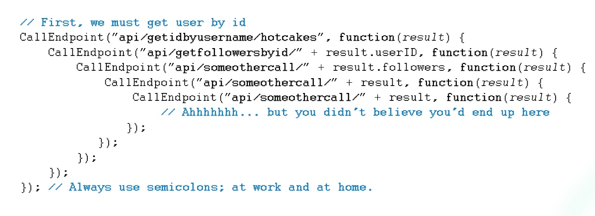

# 11.Promise 与异步编程

## 产生的背景

> 这节主要介绍 `promise` 产生的背景，与它本身用法关系不大，时间紧的话可以略过。

`js` 作为一门应 `web` 而诞生的单线程语言，其异步操作，从 处理 `DOM` 事件监听，到处理网络请求，处处可见它的身影。

刚开始，它是用回调函数处理异步请求的。这在`web` 刚发展的时候，网页大多是展示型，网络请求不过，`js` 用回调处理异步请求，已经够用了:

```
// 伪代码
request(url, function(data){
	...
})
```

但随着 `web` 前端页面承载的功能越来越多时，网络请求之间存在依赖关系时，继续单纯地用回调就可能写出这种代码来:



网络上给这种回调取名 `callback hell` ，形象地说明了它的可怕，维护太难。

后来社区里出现了解决这类问题的方法库，逐渐推广开来，成为事实上的解决这类问题的标准。`ES` 应时代需求，将它纳入规范，这这就今天的 `promise`。

## promise 基本介绍

声明一个 `promise` 特别简单, `new` 一个构造函数 `Promise` 即可:

```
let promise = new Promise((resolve, reject) => {
	...
})
```

异步处理成功则调用 `resolve` 函数并传入处理结果，失败则调用
`reject`并传入错误信息。 

然后调用 `then` 处理异步处理结果，`then` 的第一个参数处理成功的数据，第二个参数处理失败的数据: 
 
```
promise.then((data) => {
	...
}, (err) => {
	...
})
```

当然，这两参数都是可选的:


```
// 只处理成功的结果
promise.then((data) => {
	...
})

// 只处理失败的结果
promise.then(null, (err) => {
	...
})
```

从上面可以看到，`promise` 返回结果有两种状态

1. `resolved`: promise 处理成功;
2. `rejected`:  promise 处理失败;

其实`promise`还有第三种状态:

`pending`: 表示正在处理中，就是返回成功或失败的结果前的某段时间。

在 `chrome`控住台输出 `promise`，可以看到 `promise` 下有内在属性 `[[PromiseStatus]]`，它表示 `promise` 当前所处的状态, `pending | resolved | rejected`:


下面模拟下异步请求的例子, 直观感受下:

1. 成功的处理

	```
	let promise = new Promise((resolve, reject) => {
	  setTimeout(() => {
	    resolve('hi jeyvie, succeeded')
	  }, 1000)
	
	})
	
	promise.then(info => console.log(info))
	
	// hi jeyvie, succeeded
	```
2. 失败的处理

	```
	let promise = new Promise((resolve, reject) => {
	  setTimeout(() => {
	    resolve('hi jeyvie, failed')
	  }, 1000)
	
	})
	
	promise.then(null, info => console.log(info))
	
	// hi jeyvie, failed
	
	```
	
	更好的异常处理，可以是用 `catch` (这在下文提到链式操作里显得更重要了) ：
	
	```
	promise.catch(info => console.log(info))
	```
	

## promise 全局错误处理

`js` 语言里，只要代码里某处发生错误，就会阻断整个程序的运行。一直以来，这一这特性给予开发者迅速定位错误的能力，方面他们找出程序中的问题。但 `promise` 是个例外, 如果不手动 `catch` 错误，你根本不知道 `promise` 里是否发生了错误, 如下例:

```
let rejected = new Promise((resolve, reject) => {
  throw new Error('err info')
})

rejected.catch(err => console.log(err))
```

如上面的例子，`promise` 内部抛出了错误，但直到调用 `catch`, 它的错误才会被处理。而且，因为 `then` 和 `catch` 可以放在 `promise` 实例化后的任何位置，而不管 `promise` 是否已经操作完毕(状态切换成了`resolved` 或 `rejected`)。 这让开发者很难准确的判断一个 `promise` 是否被处理，这也是 `promise` 最让人诟病的地方。


虽然 `ES` 规范里对此尚没给出响应，但浏览器和 `Node.js` 已给出了解决方案。


### 浏览器里的 rejection 处理

浏览器在 `window` 上提供了两个处理 promise 失败 ( `rejection` ) 的事件, 来判断 `rejection` 是否被处理过:

1. **unhandledrejection** 在一次事件循环之内，如果 `promise` 失败了但没有没有错误处理函数，那这个事件就会被触发,
2. **rejectionhandled** 在一次事件循环之后，如果 `promise` 失败了且它的错误处理函数调用了，那这个事件就会被触发。

针对 `rejectionhandled` 有人也许会想，既然 `promise` 的错误已经被处理了，那还要这个事件干嘛呢。别急，下文会有介绍。

不过我们还是先说说这两个事件的事件对象，他俩的事件对象都会有以下这些属性:

1. **type** 事件名，`unhandledrejection` 或 `rejectionhandled`

2. **promise** 发生异常的 `promise` 对象

3. **reason** 发生异常的原因

使用方法如下例:


```
let rejected;
window.onunhandledrejection = function(event) {
    console.log(event.type);                   // "unhandledrejection"
    console.log(event.reason.message);         // "Explosion!"
    console.log(rejected === event.promise);   // true
};

window.onrejectionhandled = function(event) {
    console.log(event.type);                   // "rejectionhandled"
    console.log(event.reason.message);         // "Explosion!"
    console.log(rejected === event.promise);   // true
};

rejected = Promise.reject(new Error("Explosion!"));
```

上文留了个疑问，为什么要有 `rejectionhandled` 监听已经被处理的 `rejection`。假如我们想记录下没有被处理的 `rejection`，以备后期处理，那我们可以在 `onunhandledrejection` 事件里把 `rejection` 存在一个 `set` 里就可以了。但有个问题，有的 `rejection` 可能在事件触发时的确没有被处理，但之后又被处理了(原因看这节开头 —— `catch` 可任意放置)，这时，我们可以利用 `onrejectionhandled` 讲这个`rejection` 从 `set` 里清除出去。 完整的例子如:


```
let possiblyUnhandledRejections = new Map();

// when a rejection is unhandled, add it to the map
window.onunhandledrejection = function (event) {
  possiblyUnhandledRejections.set(event.promise, event.reason);
};

window.onrejectionhandled = function (event) {
  possiblyUnhandledRejections.delete(event.promise);
};

setInterval(function () {
  possiblyUnhandledRejections.forEach(function (reason, promise) {
    console.log(reason.message ? reason.message : reason);
    // do something to handle these rejections
    handleRejection(promise, reason);
  });
  possiblyUnhandledRejections.clear();
}, 60000);
```


> 提示: 在本地测试这些事件时, 如果脚本和html文件不在一个文件时 -- 即脚本是通过script标签引入，而不是写在script标签里, 事件不会被触发，[详见这里](https://stackoverflow.com/questions/40026381/unhandledrejection-not-working-in-chrome)


### Node.js 里的 rejection 处理

`Node.js` 的处理方式和浏览器的很相似，也是有两个事件

1. **unhandledRejection**  对应浏览里的 **unhandledrejection**
2. **rejectionHandled** 对应浏览里的 **rejectionhandled**


不同的是，传入的参数不一样:

`unhandledRejection` 的事件回调里有接收两参数，分别表示

1. 失败的原因，
2. 当前的promise。

如:

```
let rejected;
process.on("unhandledRejection", function (reason, promise) {
  console.log(reason.message);            // "Explosion!"
  console.log(rejected === promise);      // true
});
rejected = Promise.reject(new Error("Explosion!"));
```

而 `rejectionHandled` 回调函数里接收一个参数，表示失败的 `promise`:

```
let rejected;
process.on("rejectionHandled", function (promise) {
  console.log(rejected === promise);      // true
});
rejected = Promise.reject(new Error("Explosion!"));

// wait to add the rejection handler
setTimeout(function () {
  rejected.catch(function (value) {
    console.log(value.message); // Explosion
  });
}, 1000);
```

和浏览器里的一样，它们也可以结合起来收集未被处理的失败的 `promise`:


```
let possiblyUnhandledRejections = new Map();

// when a rejection is unhandled, add it to the map
process.on("unhandledRejection", function (reason, promise) {
  possiblyUnhandledRejections.set(promise, reason);
});

process.on("rejectionHandled", function (promise) {
  possiblyUnhandledRejections.delete(promise);
});

setInterval(function () {
  possiblyUnhandledRejections.forEach(function (reason, promise) {
    console.log(reason.message ? reason.message : reason);
    // do something to handle these rejections
    handleRejection(promise, reason);
  });
  possiblyUnhandledRejections.clear();
}, 60000);
```


## 链式操作
写过 `jQ` 都清楚它的链式操作非常方便，`promise` 也支持链式操作，`promise` 实例调用 `then` 或  `catch` 后都会返回一个新的 `promise`。


```
new Promise(function(resolve, reject) {
  resolve(42);
}).then(function(value) {
  console.log(value);         // "42"
  return value + 1
}).then(function(value) {
  console.log(value);         // "43"
  throw new Error('error')
}).catch(function(error) {
  console.log(error);      // error
});
```

如上，第一个 `then` 返回 `value + 1`, 传递到第二个 `promise` 的 `then` 里，它里出一个错误，可以被第三个`promise` 的 `catch` 捕获到，从上到下传递。其传递的值也可以 `promise`。如可以之前的 `callback hell`, 可以用`promise` 的链式操作改造下:

```
new Promise((resolve) => {
  setTimeout(() => resolve(1), 1000)
}).then(data => {
  return new Promise(resolve => {
    setTimeout(() => resolve(data + 2), 1000)
  })
}).then(result => {
  console.log(result);
  throw new Error('throw err')
}).catch(err => {
  console.log(err)
})
```

## 同时处理多个promise
`Promise` 提供了两个静态方法：


1. **Promise.all()**  接受一个其内容是 `promise` 的 `iterable`, 如一个子项都是 `promise` 的数组。当 `iterable` 里所有的 `promise` 都成功后，它返回的 `promise` 才会成功; 其中任何一个失败，返回的 `promise` 失败处理函数立即执行，不等 `iterable` 里其他  `promise` 执行结果。如：


	```
	let p1 = new Promise(function (resolve, reject) {
	  resolve(42);
	});
	
	let p2 = new Promise(function (resolve, reject) {
	  resolve(43);
	});
	
	let p3 = new Promise(function (resolve, reject) {
	  resolve(44);
	});
	
	let p4 = Promise.all([p1, p2, p3]);
	
	p4.then(function (value) {
	  console.log(Array.isArray(value));  // true
	  console.log(value[0]);  // 42
	  console.log(value[1]);  // 43
	  console.log(value[2]);  // 44
	});
	```
	
	
	上面 `Promise.all` 返回 `p4` 的 `then` 的回调， 接收一个数组，里面的值，对应着各 `promise` 的返回结果。


2. **Promise.race()** 接收的参数跟上面 `all` 一样，不过参数里的只要有一个 `promise` 执行完成，不管成功或失败，`race` 返回的 `promise` 也就马上改变状态，执行相应的处理函数。跟名字一样，参数里的`promise` 在比赛(`race`)一样。

	
	1. 都 `resolve` 的例子
	
		```
		let p1 = Promise.resolve(42);
		let p2 = new Promise(function (resolve, reject) {
		  resolve(43);
		});
		let p3 = new Promise(function (resolve, reject) {
		  resolve(44);
		});
		let p4 = Promise.race([p1, p2, p3]);
		p4.then(function (value) {
		  console.log(value);     // 42
		});
		```
	2. 有 `reject` 的例子

		```
		let p1 = new Promise(function (resolve, reject) {
		  setTimeout(() => {
		    resolve(42);
		  }, 3000) 
		});
		
		let p2 = Promise.reject(43)
		
		let p3 = new Promise(function (resolve, reject) {
		  setTimeout(() => {
		    resolve(44);
		  }, 3000)   
		});
		let p4 = Promise.race([p1, p2, p3]);
		
		p4.catch(function (value) {
		  console.log(value);     // 43
		});
		```


## promise 与继承

假如你想基于内置的 `Promise`， 拓展一个自己的 `Promise`, 如添加 `success` 和 `fail` 方法， 你可以这样做:


```
class MyPromise extends Promise {
  
  success(resolve, reject) {
    return this.then(resolve, reject);
  }
  fail(reject) {
    return this.catch(reject);
  }
}

let promise = new MyPromise(function (resolve, reject) {
  resolve(42);
});

promise.success(function (value) {
  console.log(value);  // 42
}).fail(function (value) {
  console.log(value);
});
```

## 结语

 `promise` 可以方便地让不同的异步操作组合起来， 大大提升了 `js` 异步编程的能力。
 	
虽然 `promise` 很强大，但在不能准确地监听 `rejection`。好在浏览器和 `Node.js` 都已给出了对应的解决方案。
 	
现在大部分浏览器已经支持它了，对于不支持它的也有相关的兼容库，可以放心地使用它。

